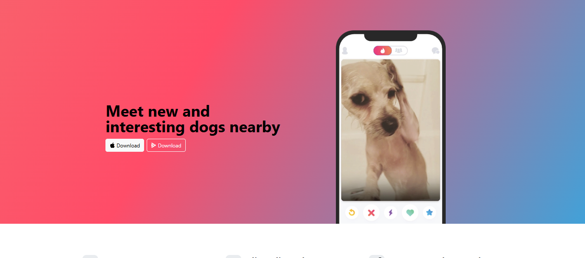

# 🐶 TinDog

A modern and responsive landing page for **TinDog**, a fictional dog-matching application inspired by Tinder. This project was built using **HTML5**, **CSS3**, and **Bootstrap 5** to practice responsive web design and component-based layouts.

## 📸 Preview



## ✨ Features

* Fully responsive design
* Modern Bootstrap 5 components
* Hero section with call-to-action buttons
* Feature highlights section
* Customer testimonial section
* Pricing plans
* Responsive footer
* Clean and attractive UI

## 🛠️ Built With

* HTML5
* CSS3
* Bootstrap 5
* Bootstrap Icons
* Google Fonts

## 📚 What I Learned

Through this project, I gained practical experience with:

* Bootstrap Grid System
* Responsive Layout Design
* Bootstrap Components
* Flexbox Utilities
* Typography and Spacing
* Landing Page Design Principles
* Mobile-First Development

## 🚀 Getting Started

### Clone the Repository

```bash
git clone https://github.com/your-username/tindog.git
```

### Run Locally

1. Navigate to the project folder.
2. Open `index.html` in your browser.

Or use **VS Code Live Server** for the best development experience.

## 📂 Project Structure

```text
TinDog/
│
├── css/
│   └── style.css
│
├── images/
│   ├── iphone.png
│   ├── dog-img.jpg
│   ├── techcrunch.png
│   ├── mashable.png
│   ├── bizinsider.png
│   └── tnw.png
│
├── index.html
└── README.md
```

## 🎯 Future Improvements

* Add dark mode support
* Add smooth scrolling navigation
* Add animations using CSS or JavaScript
* Integrate a real backend for user registration
* Improve accessibility features

## 👨‍💻 Author

**Sameer Raj**

Computer Engineering Student passionate about Web Development and building user-friendly web applications.

---

⭐ Feel free to fork this project and give it a star if you found it useful!
